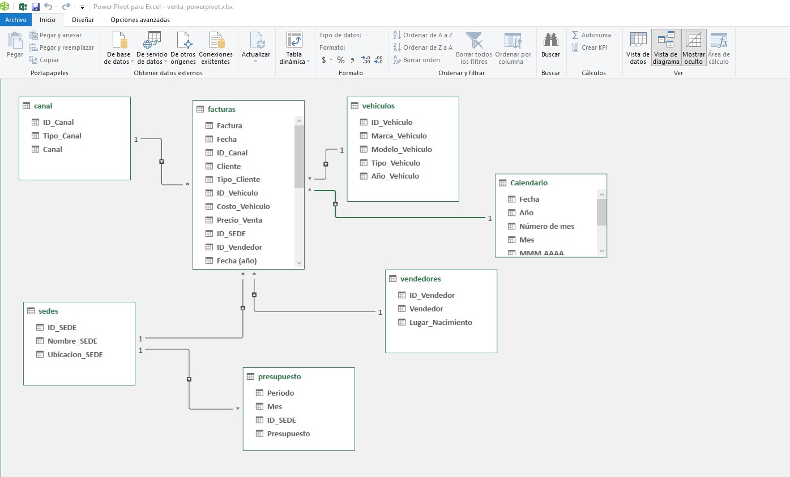

# Power Pivot y DAX en Excel — Base 3

## Objetivo

Implementar en Excel un modelo relacional de ventas mediante Power Query,
Power Pivot y DAX, para analizar el rendimiento comercial con tablas dinámicas,
gráficos dinámicos, KPIs y segmentadores.

Esta etapa reutiliza la estructura del proyecto principal de análisis de ventas
y demuestra cómo trasladar un modelo de datos de Power BI al entorno de Excel.

## Herramientas

- Excel
- Power Query
- Power Pivot
- DAX
- Tablas dinámicas
- Gráficos dinámicos
- Segmentadores

## Modelo de datos

La tabla central de hechos es `facturas`, relacionada con las siguientes
dimensiones:

- `canal`
- `sedes`
- `vendedores`
- `vehiculos`
- `Calendario`

Además, se incorporó la tabla `presupuesto` para analizar el cumplimiento de
ventas por sede y período.

Relaciones principales:

```text
canal[ID_Canal]              1 ─── * facturas[ID_Canal]
sedes[ID_SEDE]               1 ─── * facturas[ID_SEDE]
vendedores[ID_Vendedor]      1 ─── * facturas[ID_Vendedor]
vehiculos[ID_Vehiculo]       1 ─── * facturas[ID_Vehiculo]
Calendario[Fecha]            1 ─── * facturas[Fecha]
sedes[ID_SEDE]               1 ─── * presupuesto[ID_SEDE]
```

## Medidas DAX

Se reutilizaron y adaptaron medidas DAX para calcular:

- Ventas totales
- Coste total
- Margen
- Número de facturas
- Ticket promedio
- Presupuesto total
- Cumplimiento frente a presupuesto
- Participación de ventas
- Ranking de vendedores

Las fórmulas se encuentran en `medidas_dax.md`.

## Dashboard

El dashboard incluye:

- KPIs de ventas, margen, cumplimiento, ticket promedio y número de facturas.
- Ventas por sede.
- Ventas por canal.
- Ranking de vendedores.
- Evolución mensual de ventas.
- Segmentadores por canal, sede, vendedor, trimestre y año.

## Evidencia visual

### Modelo relacional

.

### Dashboard


## Aprendizajes

- Carga de tablas desde Power Query al Modelo de datos de Excel.
- Creación de relaciones uno a muchos en Power Pivot.
- Creación y reutilización de medidas DAX.
- Uso de contexto de filtro con segmentadores.
- Construcción de tablas dinámicas y gráficos dinámicos a partir de un modelo relacional.
